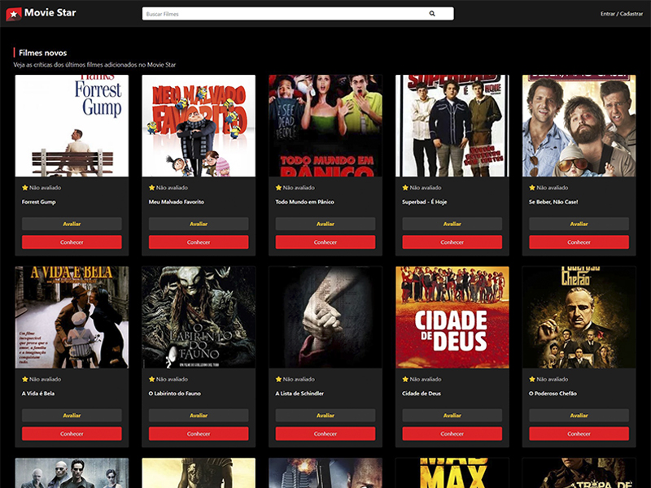

# Portfolio - Movie Star

Movie Star: Create, read, update, delete your movies. Share your reviews on other people's films. This is a portfolio project whose main focus is to consolidate learning and ideas.

Technologies: Technologies: Vanilla PHP + MySQL + Bootstrap.

## WARNING

On github you do not have access to database.php file and SQL database. Check 'Settings' on table of contents if you want to set up the project for yourself.

## Table of contents

- [Overview](#overview)
  - [The challenge](#the-challenge)
  - [Screenshots](#screenshots)
  - [Links](#links)
  - [Settings](#settings)
- [My process](#my-process)
  - [Built with](#built-with)
  - [What I learned](#what-i-learned)
  - [Continued development](#continued-development)
- [Author](#author)

## Overview

### The challenge

Users should be able to:

- Register and login.
- Update password, image and bio profile.
- Create, read, update and delete a movie.
- Rate and reviews other people's movies.
- Search movies by title.

### Screenshots

Result screenshot:



### Links

- Live Page: [Movie Star](https://arthurbicego.com/projects/movie-star/)
- Author Portfolio Page: [arthurbicego.com](https://arthurbicego.com)

### Settings

<details>
  <summary>Database file</summary>

Set a new file named database.php following the code:

```php
<?php

$db_name = "moviestar";
$db_host = "localhost";
$db_user = "root";
$db_pass = "";

$conn = new PDO("mysql:dbname=" . $db_name . ";host=" . $db_host, $db_user, $db_pass);

$conn->setAttribute(PDO::ATTR_ERRMODE, PDO::ERRMODE_EXCEPTION);
$conn->setAttribute(PDO::ATTR_EMULATE_PREPARES, false);

```

</details>

<details>
  <summary>MySQL</summary>
  
  Set a new MySQL database following the query for each table:

```SQL
CREATE TABLE users (
id INT(11) UNSIGNED AUTO_INCREMENT PRIMARY KEY,
name VARCHAR(100),
lastname VARCHAR(100),
email VARCHAR(200),
password VARCHAR(200),
image VARCHAR(200),
token VARCHAR(200),
bio TEXT
);

```

```SQL
CREATE TABLE movies (
id INT(11) UNSIGNED AUTO_INCREMENT PRIMARY KEY,
title VARCHAR(100),
description TEXT,
image VARCHAR(200),
trailer VARCHAR(150),
category VARCHAR(50),
length VARCHAR(50),
users_id INT(11) UNSIGNED,
FOREIGN KEY(users_id) REFERENCES users(id)
);

```

```SQL
CREATE TABLE reviews (
id INT(11) UNSIGNED AUTO_INCREMENT PRIMARY KEY,
rating INT,
review TEXT,
users_id INT(11) UNSIGNED,
movies_id INT(11) UNSIGNED,
FOREIGN KEY (users_id) REFERENCES users(id),
FOREIGN KEY (movies_id) REFERENCES movies(id)
);

```

</details>

## My process

### Built with

- PHP
- MySQL
- Bootstrap

### What I learned

My biggest challenges were putting into practice the integration between PHP pages together with object orientation. Because at times, refactoring the code to further separate responsibilities brought new problems to be solved.

Flexbox Centering Property:

### Continued development

There is still a lot of opportunity for improvement the project. Regarding the code, it could be even more organized and clean, there is still room to refactor and reduce some "if" loops.

Regarding the functionalities, there are some ideas for improvement:

- Register

  - Verification email when registering (validate that the email belongs to the person registering).
  - Validate your password when registering (number of characters, special characters, etc.).

- Own profile

  - I forgot the password

- Film

  - Add a direct YouTube link and turn it into an embed.

- Another ideas:
  - Movies pagination for: 'Profile of others', 'Dashboard', 'Index', 'Search'.
  - Pull movies from an API and people can just rate instead of posting the movies.
  - Maybe with an accuracy info validation and a statement of responsibility the Register page can be open to everyone.

## Author

- Portfolio - [arthurbicego.com](https://www.arthurbicego.com/)
- Linkedin - [Arthur Bicego Quintaneira](https://www.linkedin.com/in/arthurbicego/)
- Github - [@arthurbicego](https://github.com/arthurbicego)
